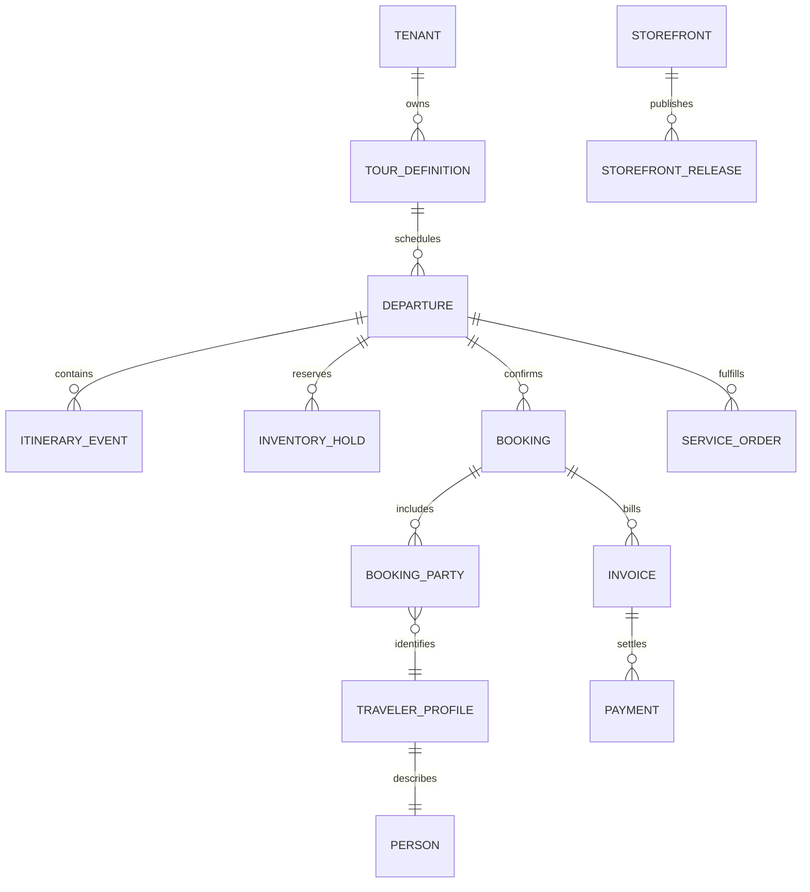

# Canonical domain model

`TourDefinition`, `Departure`, `Booking`, `Traveler` and itinerary are separate records. A tour is reusable product content; a departure is dated inventory; a booking is the immutable commercial snapshot for a party.

Money uses integer minor units plus ISO currency. Confirmed counts and active holds are checked atomically. Booking and payment statuses move only through explicit domain transitions. Traveler projections remove `STAFF` itinerary events and internal notes before returning data.

The canonical lifecycle is:

`Product → Departure → Hold → Booking → Traveler → Services → Money → Experience`
