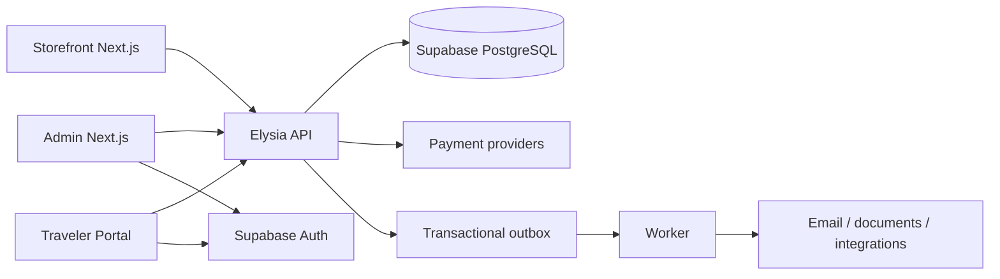

# TOMS system overview

TOMS is a multi-tenant Travel Operations OS with two deliberately separate user surfaces: the dense staff Admin and the customer-facing Storefront/Traveler Portal. Both use one canonical travel domain and one Supabase PostgreSQL source of truth.

## Runtime boundaries

- `apps/admin`: staff workflows, CRM, operations, finance, CMS and settings.
- `apps/storefront`: public discovery, checkout, confirmation and traveler portal.
- `apps/api`: Elysia HTTP boundary organized as route → service → repository → Drizzle. Protected routes validate Supabase JWTs, resolve one active tenant membership, and execute under PostgreSQL RLS context.
- `apps/worker`: hold expiry and idempotent outbox processing.
- `packages/domain`: framework-free pricing, inventory, lifecycle and authorization rules.
- `packages/contracts`: Zod request contracts shared at service boundaries.
- `packages/db`: authoritative Drizzle schema, PostgreSQL client and reusable RLS transaction context.
- `supabase/drizzle`: reviewed generated migrations plus custom PostgreSQL RLS/atomic inventory SQL.
- `supabase/seed.sql`: bilingual development data loaded into PostgreSQL; no production route reads hardcoded arrays.

The storefront never imports Admin UI. Operational writes flow through the API or narrowly scoped database functions; UI state is not authoritative. Locale-aware requests send `x-toms-locale`, while tenant storefront context is resolved from the host rather than a client-selected tenant identifier.
