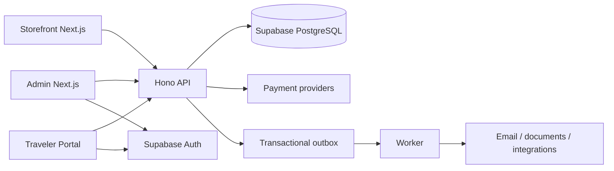

# TOMS system overview

TOMS is a multi-tenant Travel Operations OS with two deliberately separate user surfaces: the dense staff Admin and the customer-facing Storefront/Traveler Portal. Both use one canonical travel domain and one Supabase PostgreSQL source of truth.

## Runtime boundaries

- `apps/admin`: staff workflows, CRM, operations, finance, CMS and settings.
- `apps/storefront`: public discovery, checkout, confirmation and traveler portal.
- `apps/api`: typed HTTP boundary and repository port. `TOMS_DEMO_MODE=1` uses deterministic memory data for local acceptance; disabling it is intentionally blocked until a rotated server secret and production repository adapter are supplied.
- `apps/worker`: hold expiry and idempotent outbox processing.
- `packages/domain`: framework-free pricing, inventory, lifecycle and authorization rules.
- `packages/contracts`: Zod request contracts shared at service boundaries.
- `supabase`: authoritative schema, RLS, atomic booking functions and deterministic seed data.

The storefront never imports Admin UI. Operational writes flow through the API or security-definer database functions; UI state is not authoritative.
