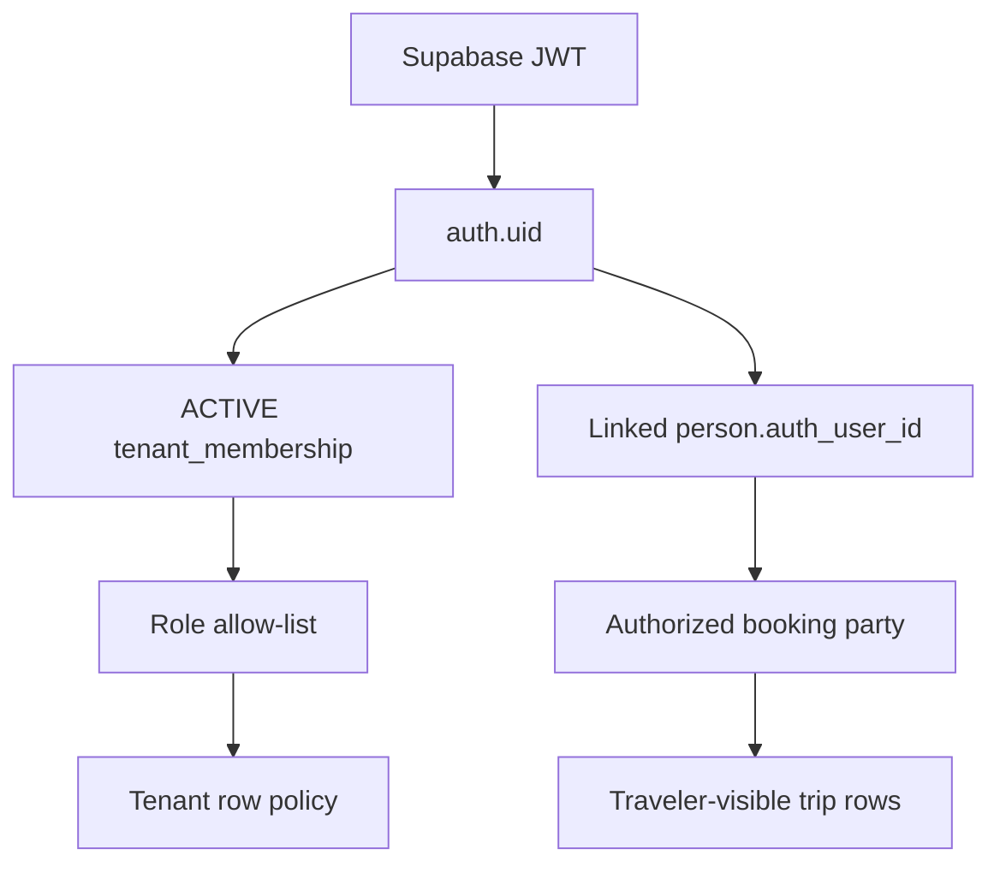

# Tenancy and RLS

Every tenant-owned table has `tenant_id`, explicit grants and row-level security. New tables are not automatically exposed through the Data API.

Staff authorization uses `private.is_tenant_member(tenant_id, roles[])`. Identity claims are read from immutable `app_metadata`, then checked against an active membership row.

Traveler claim uses `public.claim_booking(booking_id)`. The authenticated JWT email must match the organizer, payer or a traveler person on that booking. The function links only that matching person to `auth.uid()`. Booking UUID possession alone returns no access. Traveler policies expose the linked booking, party, departure, tour, traveler-visible itinerary, invoice/payment, traveler documents and non-internal messages.

Service-role-only functions perform atomic hold and booking confirmation. Their grants are revoked from `anon` and `authenticated`. Storage policies separate public storefront media from tenant and traveler documents.
