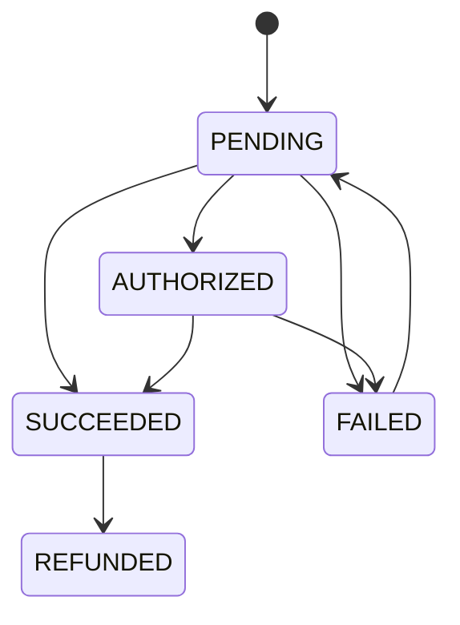

# Payment architecture

TOMS owns the internal financial ledger; providers execute payment methods. Provider payloads never replace booking, invoice or reconciliation state.

All amounts are integer minor units. A charge or refund requires an idempotency key. Provider references and FX snapshots are stored alongside the internal payment. Confirmation uses a database transaction so the hold is consumed, booking confirmed, capacity incremented and an outbox event created together.

The integration package declares provider capabilities for Demo, QPay and Stripe. The current local flow uses the deterministic Demo provider; real provider credentials and signed webhook endpoints are deployment inputs. Webhook processing must reconcile by provider reference and idempotency key before changing internal state.
