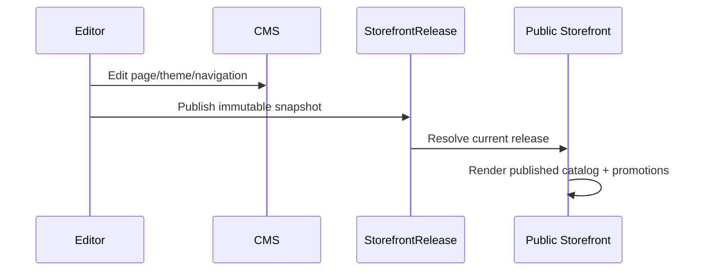

# Storefront publishing model

The Storefront is a projection, not a second catalog. It reads published tours and departures from the operational domain and combines them with a versioned presentation snapshot.

`storefront_releases.snapshot` records template, content, theme and catalog revisions. Draft edits do not change the active site until a release is published. Tenant domains resolve the storefront automatically; tenant slugs are not required in customer URLs.

Implemented public routes include `/`, `/tours`, `/tours/[slug]`, `/departures/[id]`, `/promotions`, content pages, `/checkout/[departureId]`, `/booking/confirmation/[id]`, `/login` and `/account/*`.
